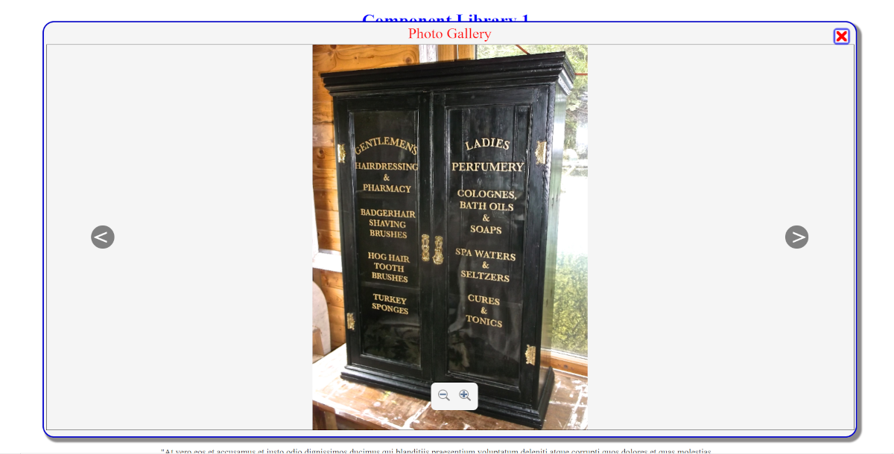

# JavaScript and CSS photo gallery SYSTEM v1.01
## By Mark Foyster



### Brief Description

The gallery utilises the popup component within this repo, placing a HTML canvas within it to display photos in a 'gallery' style arrangement.

It has controls to cycle through the images and zoom in. Drag with mouse and finger (touch) is enabled (could do with more testing on touch)

Zooming with the mouse wheel is included too.

The controls will fade away after 3 seconds of pointer inactivity over the canvas. A simple ovement of the mouse or touch of the finger will re-activate them.

### implementation

Install the Pop Up component found (HERE)[(https://github.com/mxfoyster/componentlibrary1/tree/main/popup] first.

Repeat this process with this repo, you do not need `galleryss.png` or ths readme.

Add the CSS and JavaScript sources in the `<head>` like so:

```
    <link rel="stylesheet" href="popup/popup.css">
    <link rel="stylesheet" href="menu/menu.css">
    <link rel="stylesheet" href="gallery/gallery.css">
    <script src="popup/popup.js" defer></script>
    <script src="gallery/gallery.js" defer></script>
```

Now add the following code into the `<body>` of the web page:

```
    <div class="popUp" id="popUp">
        <div class="popUpTitleContainer"><span class="popUpTitle">Photo Gallery</span></div>
        <div id="galleryCanvasContainer"></div>
         
    </div>
```

Edit *gallery.js* to add the correct folder and add your source images into the array here:

```
    const imageRoot = "./images/"; //place the subdirectory your images are in here
    const imageList = ["image1.png", "image2.png", "image3.png"]; //place your image names in this array
```

Note the comments to help guide you.

---

### Change Log

#### *v1.01*

- Updated to include a prompt as to which image is being displayed and how many images are available (eg Image 2 of 6).

#### *v1.00* 

- Initial release. Code extracted (recycled) from previous projects