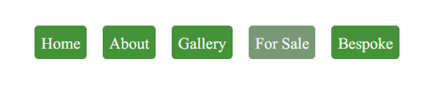

# PHP & CSS MENU SYSTEM v1.00
## By Mark Foyster

A simple 'Button' style nav bar. Here's a screenshot of it in use elsewhere:



The nav bar is set in a `flexbox` style container set to evenly distribute the buttons horizontally and overflow will wrap. it's quite plain but customising it takes little effort.

### Implementation

Simply add the stylesheet to your `<head>` like so:

```
<link rel="stylesheet" href="menu/menu.css">
```
Insert the following PHP into the page where you wish to add the menu (eg, a header container):

```
<?php $_GET['id']=1; include 'menu/menu.php' ?>
```
You will need to change the *id* number to the number corresponding to the button this page links to.

Finally, alter ***menu.php*** to suit. Here's an example:

```
<?php 
function isSelected($id){
    if ($_GET['id'] == $id) echo " class=\"menuItemSelected\"";
    else echo " class=\"menuItemUnselected menuItemHoverable\"";
}
?>
<nav class="menuContainer">
    <a href="index.php"<?php isSelected(1);?>>Home</a>
    <a href="gallery.php"<?php isSelected(2);?>>Gallery</a>
   
</nav>
```

All you need to do is change the `href` values to your pages and ensure you have the correct *id* for that page as the parameter for the `isSelected` function. 

Finally, the text between the anchor (`<a></a>`) tags is the text that will be displayed on the buttons, so alter it appropriately.

Add more anchors in the same manor to add more buttons.

### Customise the style

This is done using menu.css. There are custom properties for the colours like so:

```
:root{
	--menuColor: #45923a; /*rgba(247, 255, 247, 0.8; */
    --menuSelected: #7a9876;
}
```

Alter the colours to suit your style. Further alterations are strtaighforward by manipulating the CSS directly.


---

### Change Log

#### *v1.00* 

- Initial release. Code extracted (recycled) from previous projects