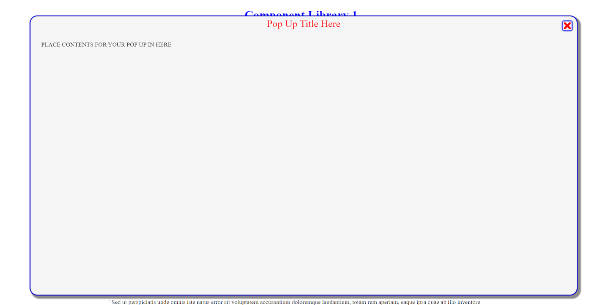

# Simple Pop Up Window v1.11           
## By Mark Foyster                 
   


### Implementation

MAKE A SUB DIRECTORY `popup` THEN ADD `popup.js`, `popup.css` & `closebtn.png` TO IT
THEN ADD THE FOLLOWING HTML WITHIN YOUR HEAD:


```
    <link rel="stylesheet" href="popup/popup.css">
    <script src="popup/popup.js" defer></script>
```
    
ADD THE FOLLOWING HTML WITHIN YOUR BODY

```
    <div class="popUp" id="popUp">
        <div class="popUpTitleContainer"><span id="popUpTitle"></span></div>
        
        <div id="popUpBody"></div>     
    </div>
```  

Within the *popup* subdirectory, create a file called default.html and place your pop up contents in it.

Use the `activatePopUp()` function to your control to launch the pop up. Pass the title as the first argument, EG:

```
    <button type="button" onclick="activatePopUp('My title Here')">Pop Up</button>
```

### Implementing multiple pop ups

This is possible because we can simply change the source file name. We create as many html files as we need inside the *popup* subdirectory and pass a second parapeter to the `activatePopUp()` function which is the filename minus the **.html**. The function will now load this file instead of *default.html*. Here's an example, again using a button:

```
    <button type="button" onclick="activatePopUp('My title Here', 'newfile')">Pop Up</button>
```

**NOTE**: You cannot use *'override'* as a file name, it's reserved to stop external content being loaded when another component (the Gallery component for example) is using it!

### Customising style

Within the popup.css, at the top are the following custom properties:


```
:root{
    /* COLOURS */
    --popUpBackgroundColour: whitesmoke; 
    --popUpBoxShadowColour: rgb(141, 139, 139); /* Best to set this a darker tone of the background colour */
    --popUpTitleColour:red;
    --popUpBorderColour: mediumblue;
    
    /* SIZES */
    --popUpSize: 90%; /*This is the size of the entire popup relative to screen*/
    --popUpTitleFontSize: 2rem;
}

```

Simply change the colours and sizes to your preference for minor changes.

The remainder of this CSS file is pretty basic. Further customisation is easy using fundamental CSS knowledge.

Remember, it would be easy to style the content of the pop up's by using inline styles within the html content files the pop up loads. Alternatively, reference a seperate external css file in the head of your page (I suggest separate to keep things neat) and style your content that way!

---

### Change Log

#### *v1.11*

- Quick bugfix to allow fetch API to external content to be overridden in external content like when we use it for the Gallery component.

#### *v1.10*

- The pop up contents is now dynamically loaded when the function is called from a html file. Different html files can be selected when the activatePopup function is called which means we can change the content as much as we like.

#### *v1.01* 

- Addition of inner container div to PopUp Window to facilitate easier addition of content. Before, added contentcould display over title if not formatted correctly. It's now bound to the container.

- Documentation within index.php updated accordingly 

#### *v1.00* 

- Initial release. Code extracted (recycled) from previous projects